# 🏠 Thikana — Empower Your Local Business

> **One platform. Every local business.**  
> Thikana is an all-in-one SaaS platform combining geo-based business discovery, no-code website building, inventory & order management, payments (Razorpay), and an AI-powered recommendation engine — all in one place.

---

## 📑 Table of Contents

1. [Project Overview](#-project-overview)
2. [Monorepo Structure](#-monorepo-structure)
3. [thikana-api — FastAPI Recommendation Engine](#-thikana-api--fastapi-recommendation-engine)
   - [Architecture](#api-architecture)
   - [Directory Structure](#api-directory-structure)
   - [API Endpoints](#api-endpoints)
   - [Scoring Algorithm — Post Feed](#scoring-algorithm--post-feed)
   - [Scoring Algorithm — Who to Follow](#scoring-algorithm--who-to-follow)
   - [Analytics Engine](#analytics-engine)
   - [Data Flow Flowcharts](#api-data-flow-flowcharts)
   - [Setup & Running Locally](#api-setup--running-locally)
4. [thikana-web — Next.js Frontend](#-thikana-web--nextjs-frontend)
   - [Architecture](#web-architecture)
   - [Directory Structure](#web-directory-structure)
   - [Pages & Routes](#pages--routes)
   - [Key Features](#key-features)
   - [Component Map](#component-map)
   - [State Management](#state-management)
   - [Data Flow Flowcharts](#web-data-flow-flowcharts)
   - [Setup & Running Locally](#web-setup--running-locally)
5. [Full System Architecture](#-full-system-architecture)
6. [Tech Stack](#-tech-stack)
7. [Environment Variables](#-environment-variables)
8. [Pricing Plans](#-pricing-plans)

---

## 🌐 Project Overview

**Thikana** solves a real problem: local businesses have no single digital home on the internet. Thikana gives any shop owner — a neighbourhood gym, family restaurant, or corner pharmacy — a complete digital presence with:

- 📍 **Geo-based Discovery** — hyperlocal search via geohash indexing
- 🌐 **No-Code Website Builder** — drag-and-drop GrapesJS powered builder
- 💳 **Payments** — Razorpay integration for products, bookings & subscriptions
- 📊 **Analytics** — spending anomaly detection, predictions, and insights
- 🤝 **Social Graph** — follow businesses, curated post feed, "Who to Follow"
- 🏢 **Franchise Management** — multi-outlet dashboards and delegated access
- 📦 **Inventory & Orders** — full product catalog with order email notifications

---

## 🗂 Monorepo Structure

```
technions-devally-2026/
├── thikana-api/         # FastAPI recommendation & analytics backend (Python)
└── thikana-web/         # Next.js 16 full-stack frontend (JavaScript/React 19)
```

---

## 🐍 thikana-api — FastAPI Recommendation Engine

### API Architecture

The API is a **pure Python** FastAPI microservice responsible for:
- Computing personalised post feeds
- Building "Who to Follow" business discovery lists
- Running financial analytics (anomaly detection, spending insights, predictions, recommendations)

It follows a strict **layered architecture** — routes only route, all logic is in `engine/` and `models/`.

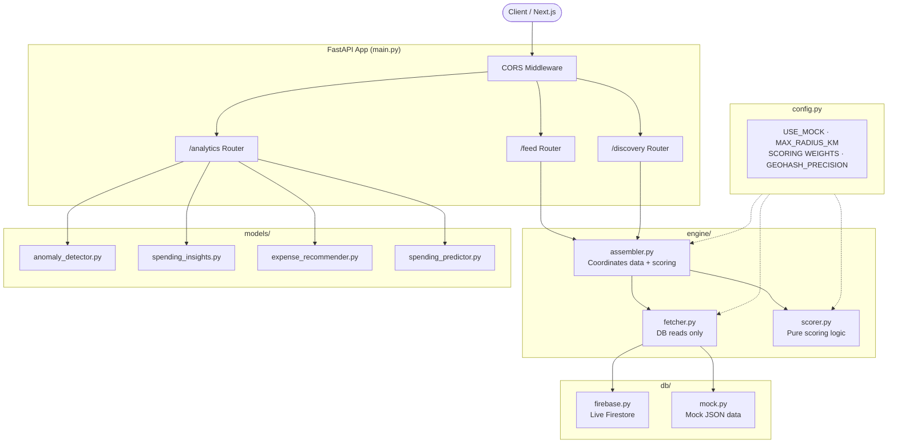

### API Directory Structure

```
thikana-api/
├── main.py                    # FastAPI app entry point, registers routers
├── config.py                  # Single source of truth for ALL settings
├── requirements.txt           # Python dependencies
├── conftest.py                # Pytest configuration
│
├── routes/                    # HTTP layer ONLY — no business logic
│   ├── feed.py                # GET /feed/{user_id}
│   ├── discovery.py           # GET /discovery/who-to-follow/{user_id}
│   └── analytics.py           # GET /analytics/* (4 endpoints)
│
├── engine/                    # Recommendation engine (Feed + Discovery)
│   ├── assembler.py           # Orchestrates fetcher + scorer
│   ├── fetcher.py             # All DB reads go here
│   ├── geohash_utils.py       # Geohash cell computation helpers
│   └── scorer.py              # Pure stateless scoring (no I/O)
│
├── core/                      # Legacy engine (v1, kept for reference)
│   ├── assembler.py
│   ├── geohash_utils.py
│   └── scorer.py
│
├── models/                    # Financial analytics models
│   ├── anomaly_detector.py    # Statistical anomaly detection
│   ├── spending_insights.py   # Category + behavioral analysis
│   ├── expense_recommender.py # Budget + saving recommendations
│   └── spending_predictor.py  # Next-month WMA forecast
│
├── db/                        # Data access layer
│   ├── base.py                # Abstract DB interface
│   ├── firebase.py            # Live Firestore implementation
│   └── mock.py                # Mock JSON implementation
│
├── data/
│   └── mock_db.json           # Local mock data for dev/tests
│
└── tests/                     # Pytest test suite
```

### API Endpoints

| Method | Path | Tag | Description |
|--------|------|-----|-------------|
| `GET` | `/` | Health | Health check — returns `{status: "ok", version: "2.0.0"}` |
| `GET` | `/feed/{user_id}` | Feed | Personalised ranked post feed |
| `GET` | `/discovery/who-to-follow/{user_id}` | Discovery | Nearby businesses to follow |
| `GET` | `/analytics/anomalies/{user_id}` | Analytics | Detect unusual transactions |
| `GET` | `/analytics/insights/{user_id}` | Analytics | Spending habits & actionable insights |
| `GET` | `/analytics/recommendations/{user_id}` | Analytics | Budget & saving strategies |
| `GET` | `/analytics/predictions/{user_id}` | Analytics | Next-month spending forecast |

**Query Parameters for `/feed/{user_id}`:**

| Param | Type | Required | Default | Description |
|-------|------|----------|---------|-------------|
| `lat` | float | ✅ | — | User's latitude (-90 to 90) |
| `lon` | float | ✅ | — | User's longitude (-180 to 180) |
| `limit` | int | ❌ | 20 | Max posts returned (1–50) |

---

### Scoring Algorithm — Post Feed

Each post is scored using a **weighted sum of three signals**:

| Signal | Weight | Logic |
|--------|--------|-------|
| Following | **55%** | `1.0` if user follows the business, else `0.0` |
| Location | **35%** | Linear decay from `1.0` at 0km to `0.0` at 10km (Haversine) |
| Recency | **10%** | Linear decay from `1.0` (now) to `0.0` at 168 hours (7 days) |

```
score = (following × 0.55) + (location × 0.35) + (recency × 0.10)
```

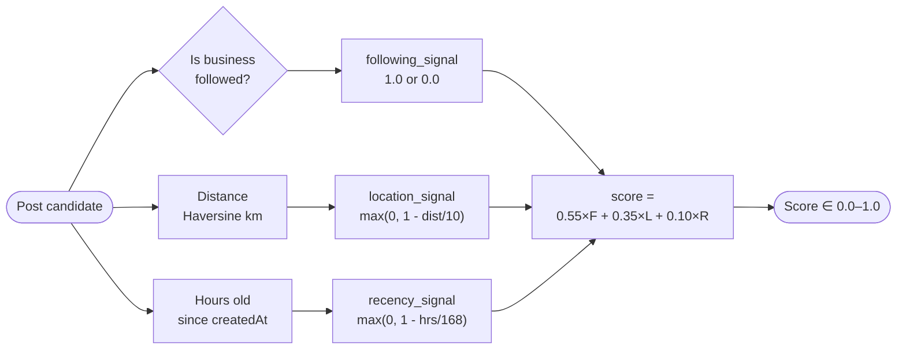

---

### Scoring Algorithm — Who to Follow

Businesses are scored for the discovery list using two signals:

| Signal | Weight | Logic |
|--------|--------|-------|
| Location | **70%** | Linear decay `1.0` at 0km → `0.0` at 10km |
| Activity | **30%** | `postCount / 20` (normalised, capped at 1.0) |

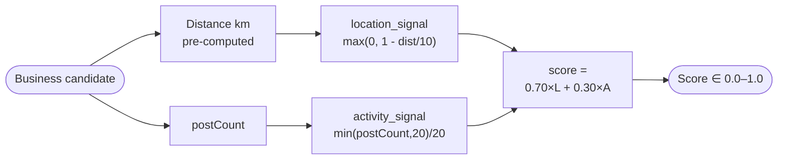

---

### Analytics Engine

Four independent, stateless models in `models/`:

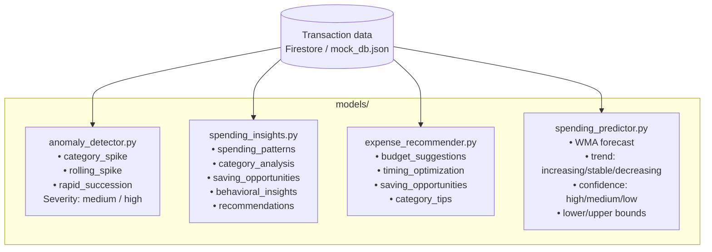

---

### API Data Flow Flowcharts

#### `/feed/{user_id}` — Build Post Feed

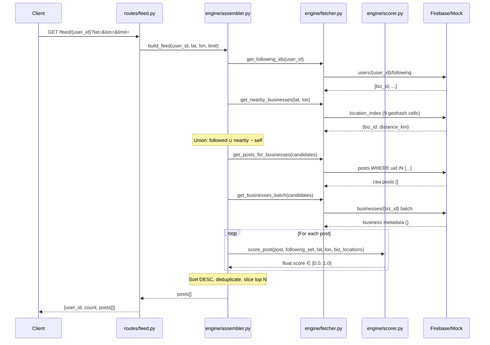

#### `/discovery/who-to-follow/{user_id}`

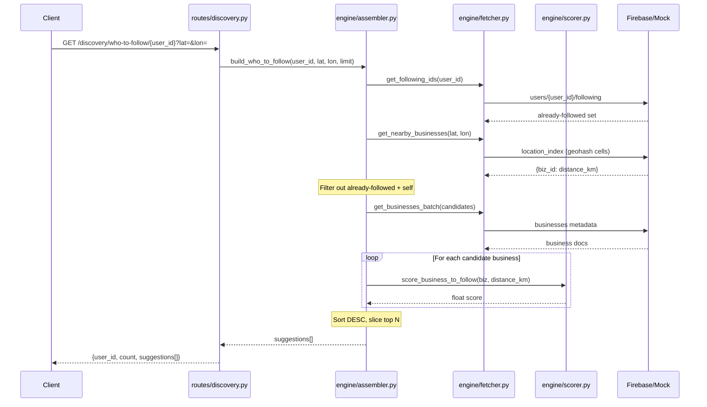

### API Setup & Running Locally

```bash
# 1. Navigate to the API directory
cd thikana-api

# 2. Create and activate a virtual environment
python -m venv venv
venv\Scripts\activate       # Windows
# source venv/bin/activate  # macOS/Linux

# 3. Install dependencies
pip install -r requirements.txt

# 4. Configure environment
# Copy .env.example to .env and fill in Firebase credentials (if USE_MOCK=False)
# For local dev, USE_MOCK=True in config.py uses data/mock_db.json

# 5. Run the server
uvicorn main:app --reload --port 8000

# 6. Interactive API docs
# http://localhost:8000/docs
```

**Configuration knobs in `config.py`:**

| Variable | Default | Description |
|----------|---------|-------------|
| `USE_MOCK` | `True` | `True` = local mock JSON, `False` = live Firestore |
| `MAX_RADIUS_KM` | `10.0` | Businesses beyond this radius are ignored |
| `GEOHASH_PRECISION` | `5` | Precision-5 ≈ 5×5 km cell |
| `RECENCY_WINDOW_HOURS` | `168.0` | 7 days — posts older than this score 0 on recency |
| `POST_WEIGHT_FOLLOWING` | `0.55` | Weight of following signal for post feed |
| `POST_WEIGHT_LOCATION` | `0.35` | Weight of location signal for post feed |
| `POST_WEIGHT_RECENCY` | `0.10` | Weight of recency signal for post feed |
| `FOLLOW_WEIGHT_LOCATION` | `0.70` | Weight of location signal for "Who to Follow" |
| `FOLLOW_WEIGHT_ACTIVITY` | `0.30` | Weight of activity signal for "Who to Follow" |

---

## ⚛️ thikana-web — Next.js Frontend

### Web Architecture

The frontend is a **Next.js 16** (App Router) full-stack application with React 19. It uses:
- **Firebase** for auth, Firestore, and Storage
- **Algolia** for search indexing
- **Razorpay** for payments
- **Zustand** for client-side state management
- **Framer Motion** for animations
- **TailwindCSS v4** for styling
- A **client-side recommendation engine** in `hooks/useRecommendations.js` that mirrors the Python scoring logic entirely in the browser (no server round-trip needed for feed)

```mermaid
flowchart TB
    Browser([Browser / User])
    
    subgraph Next["Next.js 16 App (thikana-web)"]
        direction TB
        PUB[Public Pages\n/ About / Pricing / Contact]
        AUTH[Auth Pages\n/login · /register]
        
        subgraph Dashboard["(dashboard) Route Group"]
            DASH[/dashboard]
            FEED[/feed]
            PROFILE[/profile]
            SEARCH[/search]
            NOTIF[/notifications]
            MAP[/map]
            GST[/gst-reports]
            WEB[/websites]
            CREATE[/posts · /add-product\n/add-bulk-products]
            CART[/cart]
        end
        
        subgraph API["app/api/ (Route Handlers)"]
            APIFEED[/api/feed]
            APIDISC[/api/discovery]
            APIAI[/api/ai]
            RAZORPAY[/api/razorpay]
            MAPS[/api/maps-key]
            EMAIL[/api/send-order-email]
            CONTENT[/api/generate-content]
        end
    end

    subgraph Services["External Services"]
        FB[(Firebase\nAuth + Firestore\n+ Storage)]
        ALG[Algolia\nSearch]
        RZ[Razorpay\nPayments]
        GMAPS[Google Maps\nAPI]
        GEM[Google Gemini\nAI]
        THAPI[thikana-api\nPython FastAPI]
    end

    Browser --> PUB & AUTH & Dashboard
    API --> FB & ALG & RZ & GMAPS & GEM & THAPI
    Dashboard --> API
```

### Web Directory Structure

```
thikana-web/
│
├── app/                            # Next.js App Router
│   ├── layout.js                   # Root layout (fonts, theme, auth, toaster)
│   ├── page.js                     # Landing / Marketing homepage
│   ├── globals.css                 # Global CSS variables & base styles
│   │
│   ├── (auth)/                     # Unauthenticated route group
│   │   ├── login/page.jsx
│   │   └── register/
│   │       ├── page.jsx            # Step-based business registration
│   │       └── user/page.jsx       # User registration
│   │
│   ├── (dashboard)/                # Authenticated route group
│   │   ├── layout.jsx              # Dashboard shell layout
│   │   │
│   │   ├── (with-recommendations)/ # Layout with Sidebar + WhoToFollow
│   │   │   ├── layout.jsx          # 3-col feed / 2-col default / 1-col profile
│   │   │   ├── feed/               # Personalised post feed
│   │   │   ├── map/                # Nearby businesses map view
│   │   │   ├── notifications/      # Real-time notification centre
│   │   │   ├── gst-reports/        # GST report generation
│   │   │   ├── post/               # Individual post view
│   │   │   ├── [username]/         # Public business profile by username
│   │   │   └── profile/            # My profile + sub-routes
│   │   │       ├── page.jsx        # Profile overview (176 KB — heavily featured)
│   │   │       ├── analytics/      # Spending analytics dashboard
│   │   │       ├── inventory/      # Product inventory management
│   │   │       ├── services/       # Service listings
│   │   │       └── settings/       # Account & business settings
│   │   │
│   │   ├── (create)/               # Content creation
│   │   │   ├── posts/              # Create new post
│   │   │   ├── add-product/        # Add single product
│   │   │   └── add-bulk-products/  # CSV bulk product import
│   │   │
│   │   ├── cart/                   # Shopping cart & checkout
│   │   ├── dashboard/              # Business dashboard home
│   │   ├── search/                 # Algolia-powered search
│   │   └── websites/               # Website builder
│   │       └── [websiteId]/        # Builder canvas for specific site
│   │
│   ├── about/page.js               # About page (animated)
│   ├── pricing/page.js             # Pricing plans
│   ├── contact/page.js             # Contact form
│   │
│   └── api/                        # Next.js Route Handlers
│       ├── feed/                   # Proxy to thikana-api /feed
│       ├── discovery/              # Proxy to thikana-api /discovery
│       ├── ai/                     # Google Gemini AI endpoints
│       ├── generate-content/       # AI content generation
│       ├── razorpay/               # Payment order creation
│       ├── create-product-order/   # Product checkout
│       ├── send-order-email/       # Nodemailer order emails
│       ├── send-order-status-email/# Order status update emails
│       ├── update-order-status/    # Order lifecycle management
│       └── maps-key/               # Secure Google Maps key proxy
│
├── components/                     # React components
│   ├── Navbar.js                   # Public marketing navbar (mobile-responsive)
│   ├── MainNavbar.jsx              # Dashboard top navbar
│   ├── Sidebar.jsx                 # Left sidebar (profile + nav links)
│   ├── WhoToFollow.jsx             # Right sidebar (business suggestions)
│   ├── PostCard.jsx                # Post card with likes/comments
│   ├── BasicInfoForm.jsx           # Business registration step 1
│   ├── BusinessInfoForm.jsx        # Business registration step 2
│   ├── UserBasicInfoForm.jsx       # User registration
│   ├── MapComponent.jsx            # Leaflet map component
│   ├── ProfilePage.jsx             # Business public profile
│   ├── PhotosGrid.jsx              # Photo gallery grid
│   ├── CartContext.jsx             # Shopping cart state & logic
│   ├── PaymentForm.jsx             # Razorpay payment UI
│   ├── ConnectRazorpay.jsx         # Razorpay account connection
│   ├── ImageUpload.jsx             # S3 image upload component
│   ├── ThemeSwitcher.jsx           # Dark/light mode toggle
│   │
│   ├── auth/                       # Auth-related components
│   ├── builder/                    # Website builder components (GrapesJS)
│   ├── canvas/                     # Builder canvas wrapper
│   ├── form-builder/               # Drag-and-drop form builder
│   ├── inventory/                  # Inventory management components
│   ├── product/                    # Product display components
│   ├── profile/                    # Profile sub-components
│   │   └── NearbyBusinessMap.jsx   # Leaflet map for nearby businesses
│   ├── registry/                   # Business registry components
│   ├── search/                     # Algolia search UI components
│   └── ui/                         # Radix UI primitive wrappers
│
├── hooks/                          # Custom React hooks
│   ├── useAuth.js                  # Firebase auth context
│   ├── useRecommendations.js       # useFeed + useWhoToFollow (client-side engine)
│   ├── useGetPosts.js              # Firestore posts fetching
│   ├── useGetUser.js               # Current user data
│   ├── useGetUserPosts.js          # User's own posts
│   ├── useLikePosts.js             # Like/unlike actions
│   ├── useAutosave.js              # Builder auto-save
│   └── useBusinessIdForMember.js   # Business ID resolving for team members
│
├── lib/                            # Utility libraries
│   ├── firebase.js                 # Firebase client SDK init
│   ├── firebase-admin.js           # Firebase Admin SDK (server-side)
│   ├── notifications.js            # Full notification system
│   ├── inventory-operations.js     # Inventory CRUD with Firebase
│   ├── website-operations.js       # Website builder save/publish
│   ├── followeringAction.js        # Follow/unfollow business logic
│   ├── firestoreWrites.js          # Batch write helpers
│   ├── geohash.js                  # Geohash encoding
│   ├── date-utils.js               # Date formatting utilities
│   ├── business-utils.js           # Business data helpers
│   ├── business-user.js            # Business-user relationship
│   ├── userStatus.js               # Online/offline presence
│   ├── ai/                         # AI-related libs
│   ├── data/                       # Static data / seed data
│   ├── payment/                    # Razorpay helpers
│   ├── publish/                    # Website publish logic
│   └── stores/                     # Zustand stores
│       ├── builderStore.js         # Website builder state (23 KB)
│       ├── formBuilderStore.js     # Form builder state
│       ├── chatStore.js            # Chat state
│       ├── historyStore.js         # Builder undo/redo history
│       └── uiStore.js              # Global UI state
│
├── context/                        # React context providers
│   └── ThemeContext.js             # Dark/Light theme provider
│
├── constants/                      # App-wide constants
├── utils/                          # Pure utility functions
├── public/                         # Static assets
├── next.config.mjs                 # Next.js configuration
├── package.json                    # Dependencies & scripts
└── biome.json                      # Biome linter/formatter config
```

### Pages & Routes

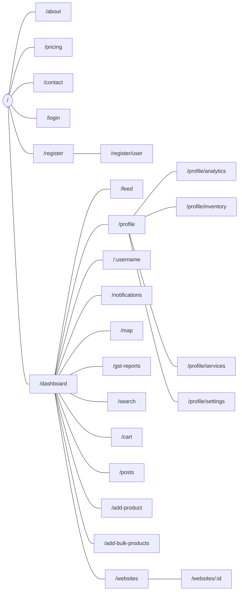

### Key Features

| Feature | Description | Tech |
|---------|-------------|------|
| **Business Registration** | Multi-step form with MSME/GST/PAN verification | Firebase, React Hook Form, Zod |
| **Feed** | Ranked posts from followed + nearby businesses | `useRecommendations.js`, Firestore, Geohash |
| **Who to Follow** | Nearby businesses user doesn't follow yet | Haversine scoring, Firestore |
| **Map Discovery** | Interactive map of businesses within 10 km | Leaflet, React-Leaflet, Google Maps |
| **Website Builder** | No-code drag-and-drop site builder | GrapesJS, Zustand, Immer |
| **Form Builder** | Drag-and-drop form creation | dnd-kit, Zustand |
| **Inventory Management** | Product catalog with CRUD + bulk CSV upload | Papa Parse, Firestore |
| **Order Management** | Full lifecycle — pending → confirmed → delivered | Nodemailer (email), Razorpay |
| **Payments** | Razorpay checkout with signature verification | Razorpay SDK |
| **Notifications** | Real-time in-app + WhatsApp + Email notifications | Firestore onSnapshot, Nodemailer |
| **Analytics Dashboard** | Spending anomalies, insights, predictions | Recharts, thikana-api |
| **GST Reports** | Auto-generated GST compliance reports | jsPDF, jspdf-autotable |
| **Algolia Search** | Instant indexed search across businesses | Algolia InstantSearch |
| **AI Content Generation** | Auto-generate post captions / descriptions | Google Gemini AI |
| **QR Codes** | Business QR code generation | react-qr-code |
| **Dark Mode** | Full dark/light theme switch | next-themes, CSS variables |
| **Mobile Responsive** | Hamburger nav, responsive layouts | TailwindCSS v4 |

### Component Map

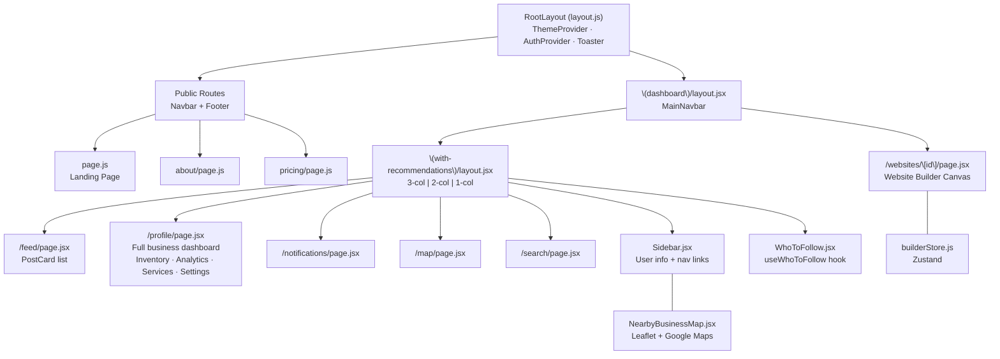

### State Management

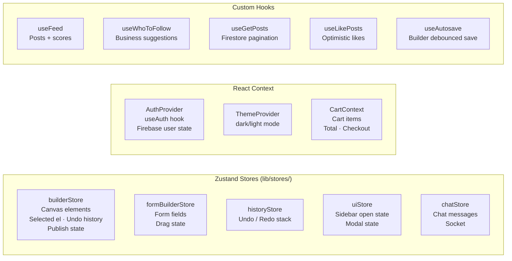

### Web Data Flow Flowcharts

#### Authentication Flow

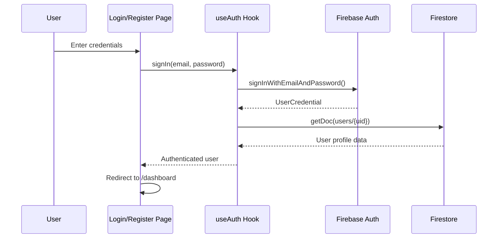

#### Post Feed Data Flow (Client-Side Recommendation Engine)

```mermaid
flowchart TD
    A([User opens /feed]) --> B[useAuth → get userId]
    B --> C[navigator.geolocation\nget lat / lon]
    C --> D[Firestore: users/{uid}/following\nGet following IDs]
    D --> E[Encode geohash, compute 9 neighbor cells]
    E --> F[Firestore: location_index/{cell}\nGet nearby business IDs]
    F --> G{nearbyIds.size == 0?}
    G -- Yes --> H[Fallback: scan all businesses\nHaversine filter ≤ 10 km]
    G -- No --> I
    H --> I[Union: following ∪ nearby − self]
    I --> J[Batch fetch business metadata\nfrom Firestore in groups of 10]
    J --> K[Batch fetch posts WHERE uid IN candidates\norderedBy createdAt DESC]
    K --> L[Score each post:\n0.55×following + 0.35×location + 0.10×recency]
    L --> M[Deduplicate, sort DESC, slice top N]
    M --> N([Render PostCard list])
```

#### Payment / Order Flow

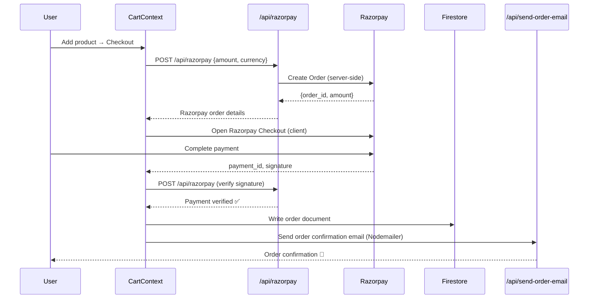

#### Notification System Flow

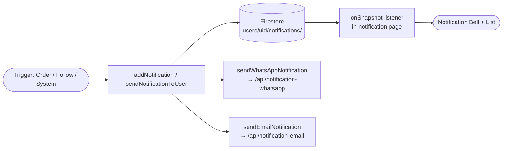

### Web Setup & Running Locally

```bash
# 1. Navigate to the web directory
cd thikana-web

# 2. Install dependencies
npm install

# 3. Configure environment variables
# Create .env.local (see Environment Variables section below)

# 4. Run the development server
npm run dev
# → http://localhost:3000

# 5. (Optional) Seed sample posts to Firestore
node seed-posts.mjs

# 6. Lint and format
npm run lint       # Biome check
npm run format     # Biome format --write
```

---

## 🏗 Full System Architecture

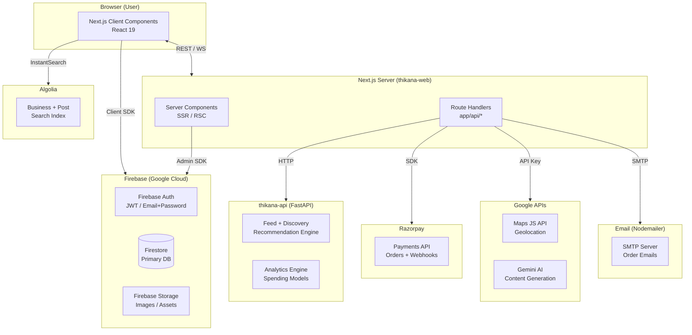

---

## 🛠 Tech Stack

### thikana-api

| Layer | Technology |
|-------|------------|
| Runtime | Python 3.11+ |
| Web Framework | FastAPI 0.100+ |
| ASGI Server | Uvicorn |
| Validation | Pydantic v2 |
| Database | Firebase Firestore (via `firebase-admin`) |
| Spatial | pygeohash (geohash encoding) |
| Analytics | pandas, numpy, scipy, scikit-learn |
| Testing | pytest |
| Config | python-dotenv |

### thikana-web

| Layer | Technology |
|-------|------------|
| Framework | Next.js 16 (App Router) |
| UI Library | React 19 |
| Styling | TailwindCSS v4 + Custom CSS |
| Animations | Framer Motion |
| Icons | Lucide React |
| UI Primitives | Radix UI (via shadcn) |
| State | Zustand + Immer |
| Forms | React Hook Form + Zod |
| Database | Firebase Firestore |
| Auth | Firebase Auth |
| Storage | Firebase Storage |
| Search | Algolia InstantSearch |
| Payments | Razorpay |
| Maps | Leaflet / React-Leaflet + Google Maps |
| AI | Google Gemini (`@google/generative-ai`) |
| Charts | Recharts |
| PDF | jsPDF + jspdf-autotable |
| Email | Nodemailer |
| DnD | dnd-kit |
| Linter | Biome |
| Fonts | Bricolage Grotesque (headings) + Manrope (body) |

---

## 🔐 Environment Variables

### thikana-api `.env`

```env
# Only needed if USE_MOCK=False in config.py
GOOGLE_APPLICATION_CREDENTIALS=../serviceAccountKey.json
```

### thikana-web `.env`

```env
# Firebase Client SDK
NEXT_PUBLIC_FIREBASE_API_KEY=
NEXT_PUBLIC_FIREBASE_AUTH_DOMAIN=
NEXT_PUBLIC_FIREBASE_PROJECT_ID=
NEXT_PUBLIC_FIREBASE_STORAGE_BUCKET=
NEXT_PUBLIC_FIREBASE_MESSAGING_SENDER_ID=
NEXT_PUBLIC_FIREBASE_APP_ID=

# Firebase Admin SDK (server-side)
FIREBASE_SERVICE_ACCOUNT_KEY=   # JSON string or path

# Algolia
NEXT_PUBLIC_ALGOLIA_APP_ID=
NEXT_PUBLIC_ALGOLIA_SEARCH_KEY=
ALGOLIA_ADMIN_KEY=

# Razorpay
RAZORPAY_KEY_ID=
RAZORPAY_KEY_SECRET=
NEXT_PUBLIC_RAZORPAY_KEY_ID=

# Google Maps
GOOGLE_MAPS_API_KEY=

# Google Gemini AI
GEMINI_API_KEY=

# Email (Nodemailer)
EMAIL_HOST=
EMAIL_PORT=
EMAIL_USER=
EMAIL_PASS=

# thikana-api URL
NEXT_PUBLIC_API_URL=http://localhost:8000
```

---

## 💰 Pricing Plans

| Plan | Price | Key Features |
|------|-------|-------------|
| **Starter** | Free forever | Geo-discovery profile, No-code website builder, Razorpay payments, Up to 50 products, Basic order management, Notifications |
| **Pro** | $29/month | Everything in Starter + Custom domain & SSL, Unlimited products, Recurring subscriptions, Invoice management, Advanced analytics, Algolia priority search |
| **Franchise** | $99/month | Everything in Pro + Unlimited outlets, Delegated owner logins, Centralized franchise dashboard, Cross-outlet analytics, Webhook + API access, Dedicated onboarding |
| **Enterprise** | Custom | Contact Sales — white-labelling, B2B supplier integrations, custom SLA |

---

## 📄 Additional Documentation

| File | Description |
|------|-------------|
| [`thikana-api/API_DOCUMENTATION.md`](./thikana-api/API_DOCUMENTATION.md) | Full REST API reference with request/response examples |
| [`thikana-api/FRONTEND_INTEGRATION.md`](./thikana-api/FRONTEND_INTEGRATION.md) | Guide for frontend engineers integrating the recommendation API |
| [`thikana-api/ANALYTICS_API_FRONTED_INTEG.md`](./thikana-api/ANALYTICS_API_FRONTED_INTEG.md) | Analytics API frontend integration guide |
| [`thikana-web/UI_DESIGN_SYSTEM.md`](./thikana-web/UI_DESIGN_SYSTEM.md) | Thikana's design tokens, typography, colour palette |
| [`thikana-web/FRONTEND_INTEGRATION.md`](./thikana-web/FRONTEND_INTEGRATION.md) | Frontend-specific API integration notes |

---

*© 2026 Thikana Technologies Pvt. Ltd. — Built with ❤️ for local businesses.*
